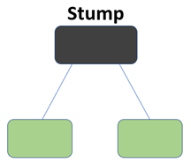
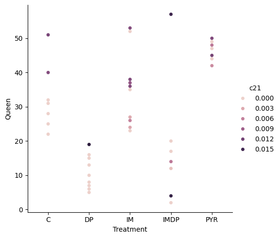
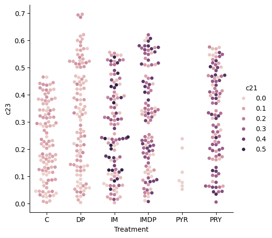
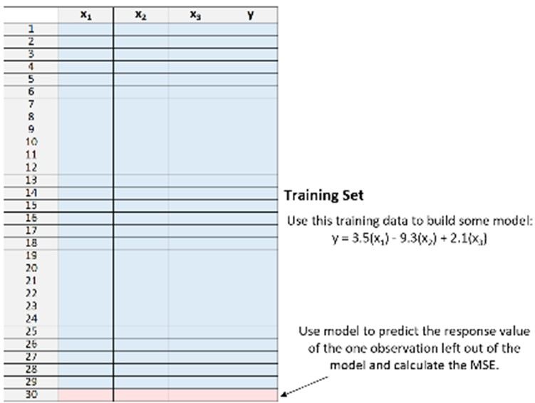
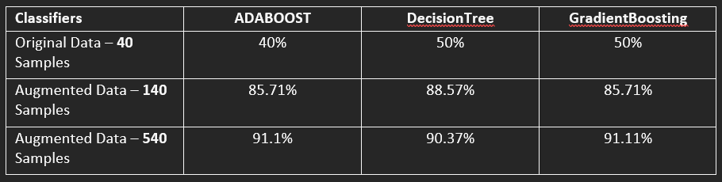
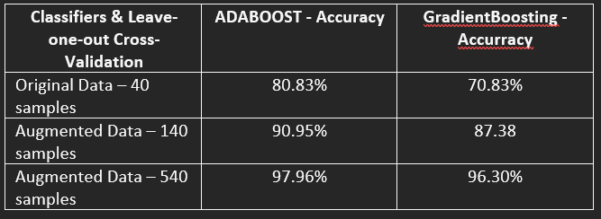

# Scikit Portforlio 
### Installation Guide 
Python Dependencies include **pandas, Scikit, Matplotlib,** and lastly **Seaborn**.
Last two libraries were strictly for data visualization purposes and are not mandatory for execution.

#### **Terminal Commands**

`pip install scikit-learn`

`pip install Matplotlib`

`pip install seaborn`

## Introduction
With the assistance of **GC-MS** (Gas Chromatography-Mass spectrometry), an instrument to identify the structure of molecular components was utilized to quantify key molecules typically present in Honeybee queen’s cuticle. These molecules consist of cuticular hydrocarbon (chc) and lipids or esters. These chc and lipids are responsible for crucial biological functionality within queen bees and are indicators to fertility and stressors.  With a dataset reflective of five diets concerning human impacts on nature; the goal was to construct a machine-learning model that would be effective in identifying the diet/treatment of a queen bee. For reference of the treatment groups look at figure 1. At first, the algorithm **ADABOOST** was used, and unsatisfactory accuracy shed some light on the issues of the dataset. Analyzing the data and its properties was crucial for success.

After a few trials and errors with different ML models, it was understood that the dataset was too meager in size for a classifier ML model. Augmentation of chemistry data was mandatory at this stage. Of course, the approach couldn’t be random and needed to be augmented through constraints that were sensible to the chemistry present in the species of honeybees. In essence, this project is a semi-supervised learning model since the augmented data were mere constructs of tangible data. As technology evolves, we humans try to exploit its power to form introspection of our physical world and the effects we impose on it. The study of biology is no different in wanting to use this power. Some insights are difficult to see from the perspective of a microscope. Machine learning algorithms provide magnification that is not only significant in finding sought-out questions, but also revealing those questions we never asked. As a species, our evolutionary dominance has made the smaller parts of our world enigmatic, but no matter how small it doesn’t take away its role in a stable ecosystem.
## Methods
The experimental project was carried out in three stages. First, I exercised trivial approaches using ADABOOST in conjunction with a decision tree classifier, and Gradient Boost for output comparison. Secondly, augmentation of the dataset with two fabrications of the dataset was constructed with different sizes. Lastly, utilization of Leave-One-Out Cross-validation on three datasets, the original dataset, small, augmented data, and the large, augmented data for accuracy comparison.
### 3.1. Phase One - Trivial Approach
The ADABOOST algorithm performs best with binary data due to its Boolean logic, (yes, or no; 1 or 0 etc.) for the resigning of weights in classifiers so dealing with float values can be challenging and potentially negatively impact the training. See figure 4. To maximize the weak learners within the ADABOOST algorithm, I added the Decision Tree classifier with a max depth of 24 to reflect the number of classifications. With one-hundred weak learners for both GradientBoost and AdaBoost; the weak learners rank the classifiers within the dataset during each iteration to achieve lower error for optimal predictions. For a visual representation look at figure 4 of this approach on the original data and figure 5 for the ADABOOST Boolean logic decision tree.

    *Figure 4. Matplotlib - 3D Accuracy of ADABOOST/GRADIENTBOOST/DECISIONTREE classifier*

Trivial approach with a ratio of 1:1 for the training/testing portion of this phase. Half the dataset is being fed into the different training models and the other half for predictions. As part of the identification process, a function designed to reshape the treatment group labels into integers for the sake of finding overlap would later be improved as the accuracy score of the model improved.



*Figure 5. ADABOOST Boolean logic Decision Tree*

Trivial approach with a ratio of 1:1 for the training/testing portion of this phase. Half the dataset is being fed into the different training models and the other half for predictions. As part of the identification process, a function designed to reshape the treatment group labels into integers for the sake of finding overlap would later be improved as the accuracy score of the model improved.

### 3.2. Phase Two - Augmentation

For more desirable results, augmentation of the data was necessary. The process of augmentation needed to be sensible to the chemical signature present within each treatment group. To combat the variability, standardize the data based on each treatment group. The reason for this is to avoid underfitting. The function would take the totality of samples from one treatment group and then normalize the data. See Figure 6 for reference. Furthermore, randomness came from subtracting or adding from the median of each chemical, and condition if the value reduced itself below zero to set it to zero as negative of any chemical signatures isn’t sensible. Cuticular hydrocarbon 21 for example is one of the chemical signatures and the presence of it in each treatment group is due to the treatment’s effects on their social harmony and maturing state. All these chemicals are associated with some functionality of cuticular or hormone communication. To keep these representative functionalities consistent within the augmentation this was the approach that was adopted. See Figures 7 and 8 for reference of this concept of c21 in the original and augmented data.[3]. The first augmented data contains 140 samples, 40 of which are from the original data. The second augmented contains 540 samples, 40 of which are from the original data as well.


```
def augmentTreatmentData(treatmentData,treatment):
    row = [treatment]
    ester34 = newData['esters34'].values
    ester34 = normalize(ester34.reshape(1,-1))
    for column  in range(25):
        if column > 0:
             j = newData.columns[column]
             chem = treatmentData[j].values
             chem = normalize(chem.reshape(1,-1))
             p50 = np.percentile(chem,50)
             lowR  = p50 - chem.mean()
             highR = p50 + chem.mean()  
             if lowR - chem.mean() < 0:
                 lowR = 0  
             row.append(np.random.uniform(low = lowR, high = highR))
             #print(row)
    p50 = np.percentile(ester34,50)
    lowR = p50 - ester34.mean()
    highR = p50 + ester34.mean()
    if lowR - ester34.mean() < 0:
        lowR = 0
    row.append(np.random.uniform(low=lowR,high=highR))
    newData.loc[len(newData.index)] = row   
```
*Figure 6. Matrix Function*



*Figure 7. Cutilcar Hydrocarbon 21 Presence in original dataset*



*Figure 8. Cutilcar Hydrocarbon 21 Presence in augmented dataset*

### 3.3 Phase Three - Leave-One-Out Cross-Validation

Finally, converting the treatment groups into matrix values to find overlap between the groups and Leave-One-Out CV to efficiently train our model. See figure 9 for reference on matrix reshape function.

```
def reshapeTreatment(x):
        
        lst = []
        for _ in range(len(x)):

            if x[_] == 'C':
                lst.append([0,0,0])
            elif x[_] == 'DP':
                lst.append([1,0,0])
            elif x[_] == 'IM':
                lst.append([0,1,0])
            elif x[_] == 'IMDP':
                lst.append([1,1,0])
            else: # Pryithian
                lst.append([0,0,1]) 
        return lst
```

*Figure 9. Matrix Reshape Function*

The accuracy was measured on multiple iteration of LOO. A function after training the models would append the accuracy of the current iteration being processed. Since LOOCV would only provide predictions on one sample data it was important to extract predictions on all the samples. See Figure 10 for illustrations of LOOCV. [2] To establish contrast between augmented data and original data were included in this process. In addition, the learning rate of all the algorithms were constant throughout the iterations. With cross-validation, one can change the learning rate and create a neurol network.



*Figure 10. LOOCV[2]*

## Results

The results of the project varied across the methods and datasets used. The results from the trivial solution when using the original data were unsatisfactory with accuracy below <50%. This was while training on the augmented dataset. The outputs were satisfactory with an accuracy score reaching above >85% for the 140 sample datasets and >90% for the 540 datasets. The results are shown below in Figure 11.



Finally, the results from the LOOCV technique were much more promising than the trivial ones. It was especially promising when it came to the original dataset.



## Discussion

Much of the work I did was trying to understand the capabilities of the dataset by modifying the ADABOOST and Gradient Boost algorithm parameters in different increments. What I found was that both algorithms produced exact or similar accuracy scores that were not satisfactory. Of course, this had to do with the lack of samples of the treatment groups, but to ensure that wasn’t the case, I ran different experiments to see that the variability within each chemical classification didn’t skew the output. Still, that approach produced similar classification predictions for the classes that I picked to test.  In addition, training the model with only two treatment groups that are closely related in terms of physical conditions produced unsatisfactory predictions. Furthermore, it became apparent to me that with the techniques at play to have an outcome that would be successful – dissection of the chemistry was mandatory.  At this stage of the project, I began to use other techniques such as Support Vector Classification (SVC) and Leave-One-Out (LOO). The idea for SVC is that it works well when the dataset has more dimensions than samples. This means it would ideally perform better than previous models since the ratio of sample/classification was 40:26 and 40 of those samples should be broken down into 5 different categories reflective of the treatment groups.  Leave-One-Out on the surface also provided optimism because it allowed the model to train on 96% of the dataset while providing prediction classifications on one sample. The interaction of the data with these different methods provided insight on the optimal approach which meant Leave-One-Out is the main gear for this operation. At last, using all these methods and finding little success with them led me to construct a program for the augmentation of the dataset. 

## Conclusion and Future Work

Once augmentation was complete, the previously mentioned ML models had more than 500 samples to work with which gave a lot of flexibility for experimentation. In addition, with cross-validation, the original dataset proved to enable the model to output more accurately with scores of above 70% which was higher than the trivial approach. Ultimately, the accuracy score for all the models naturally went up but with some minor differences. Furthermore, some future works would be to experiment with the contrast between the classifications, which would be fascinating. Since these classifications are tied to applications of social harmony within honeybee insects, it would be interesting to see how the evidence connects back to colony behavior. Making a neural network that can backtrack its way to predicting the social dynamics of colony development since that data is already known. 

## References 

[1] 	V. Lyashenk and A. J. , "Neptune.ai," Ml Model Development, 12 April 2024. [Online]. Available: https://neptune.ai/blog/cross-validation-in-machine-learning-how-to-do-it-right. [Accessed 5 May 2024].
[2] 	Z. Bobbit, "Statology," A Quick Intro to Leave-One-Out Cross-Validation (LOOCV), 3 November 2020. [Online]. Available: https://www.statology.org/leave-one-out-cross-validation/. [Accessed 4 5 2024].
[3] 	C. L. Vernier, J. J. Krupp, K. Marcus, A. Hefetz, J. D. Levine and Y. Ben-Shahar, "National Library of Medicine," The cuticular hydrocarbon profiles of honey bee workers develop via a socially-modulated innate process, 5 February 2019. [Online]. Available: https://www.ncbi.nlm.nih.gov/pmc/articles/PMC6382352/#:~:text=As%20a%20bee%20ages%20it,the%20environment%20within%20the%20hive.. [Accessed 6 May 2024].

## Appendix

Python Dependencies include **pandas, Scikit, Matplotlib,** and lastly **Seaborn**.
Last two libraries were strictly for data visualization purposes and are not mandatory for execution.

#### **Terminal Commands**

`pip install scikit-learn`

`pip install Matplotlib`

`pip install seaborn`
